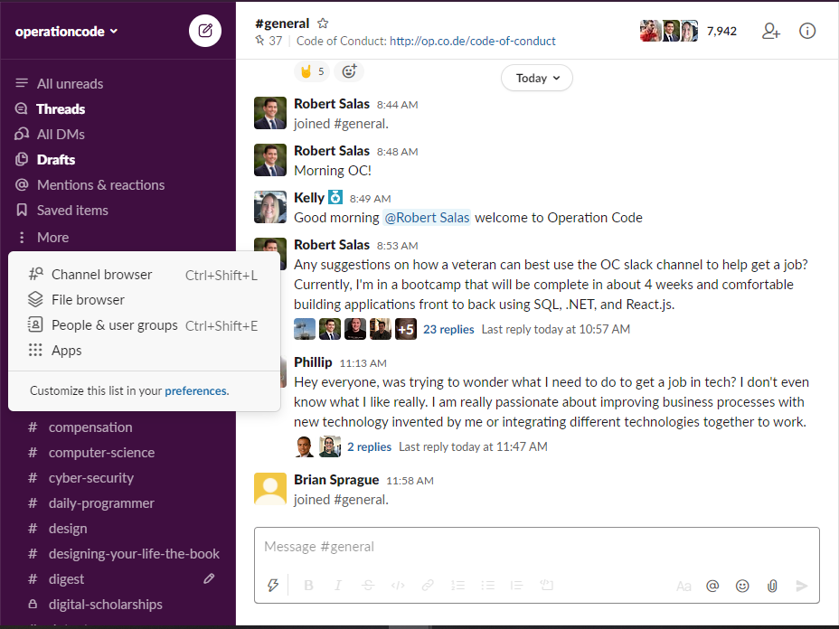

# Operation Code Welcome Aboard Prompt

Operation Code is a non-profit charity that is made up of motivated volunteers that strive to help transitioning service members, veterans, and military spouses learn more about the tech industry. OC strives to support the military community learn about software development, entering the tech industry, and code the future. Visit [Operation Code](https://operationcode.org/) for more information

## What brings you to Operation Code today and how can we help you? 
*“I’m brand new to programming and exploring my options.”*
- Start coding right away at [freeCodeCamp](http://freecodecamp.org/) or check out our extensive database with thousands of learning resources on [Operation Code Resources](https://operationcode.org/resources/)
- Join the different channels based on your interest such as **#python, #javascript**. Or visit **#help** to ask a question and get some guidance. 

*“I’m interested in going to a coding bootcamp or college.”*
- Ask people who have attending by joining the **#coding-schools** or **#college** channels 

*“I’m a recent bootcamp/college graduate or looking for a job.”*
- Post resume on **#career-advice** to have your resume reviewed or ask career related questions
- Join the **#daily-programmer** channel to practice coding problems you may encounter on a interview
- Speak to a mentor for a more 1-on-1 conversation by typing **/mentor** on any channel
Keep an eye on the **#job-board** channel or ask specific questions like pay on the **#compensation channel**

*“I want to volunteer or help out Operation Code.”*
- If you wish to volunteer or mentor fill out the form at **/mentor-volunteer**

*“The company I work at has a few job openings, where should I post them.”*
- Post job openings on the **#job-board** channel

*“I’d like to learn more about …”.*
- Explore our numerous channels on a specific subject, or if you don’t see a channel ask on the **#help** or create a new channel. Be advised that the **#general** channel is reserved for announcements and greeting new members and questions should be redirected to specific channels such as: 
  - **#career-advice** for resume reviews or any professional related questions
  - **#job-board** for all job postings 
  - **#daily-programmer** to practicing coding problems 
  - Language specific channels such as **#python, #java, #javascript**, etc. 
  - Specific geographic channels such as **#san-diego, #san-francisco**, etc. 
  - Specific channels such as **#web-dev, #cyber-security, #dotnet, #computer-science**, etc. 
  - **#random** for memes and other miscellaneous chatter
  - **#transitioning** for those moving from the military into the civilian workforce  
  - **#active-duty** for all our brothers and sisters still serving
  - **#oc-projects** to collaborate on the Operation Code website and a good place to learn about open source. Visit the Operation Code Github [repo](https://github.com/OperationCode) to learn more
  - **#help** for general questions 

## Additional Resources
- [Community Guidelines](https://github.com/OperationCode/START_HERE/blob/master/community_guidelines.md)
- [Operation Code Code of Conduct](https://github.com/OperationCode/operationcode_docs/blob/master/community/code_of_conduct.md)
- Operation Code Staff POC [email](mailto:staff@operationcode.org)
- Operation Code [LinkedIn](https://www.linkedin.com/school/operationcode/)

## How to Explore Operation Code Channels

Click the “More” on the left side navigation bar and select “Channel Browser”

Explore the different channels on Operation Code that interest you

Once you’ve found a channel that interests you, click the green “Join Channel” button. 

